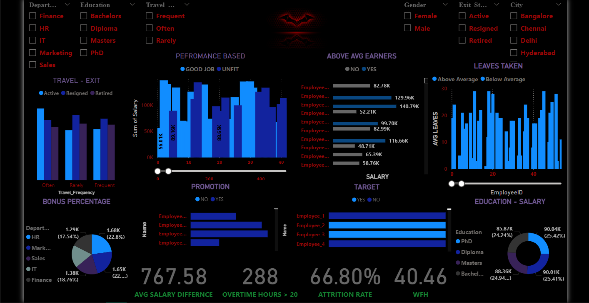

# 📊 Sales Analytics — Power BI Dashboard

Interactive Power BI dashboard built on Superstore Sales data
analyzing revenue, profit, regional performance, and customer
segments across 9,994 orders.

## 📸 Dashboard Preview


## 🔍 What's Inside
- **KPI Cards** — Total Revenue · Total Profit · 
  Profit Margin % · Avg Order Value
- **Revenue by Category** — Technology vs Furniture 
  vs Office Supplies
- **Regional Performance** — West · East · Central · South
- **Monthly Trend** — Revenue + Profit over time
- **Top Sub-Categories** — Pareto revenue breakdown
- **Discount Impact** — How discounting affects margin
- **Customer Segments** — Consumer · Corporate · Home Office
- **Slicers** — Filter by Year · Category · Region · Segment

## 📊 Dataset
Superstore Sales — 9,994 orders × 21 columns
Sales · Profit · Discount · Quantity

## 🛠️ Tools Used
Power BI Desktop · DAX · Data Modeling

## 📐 DAX Measures Used
```dax
Total Revenue = SUM(superstore[Sales])

Total Profit = SUM(superstore[Profit])

Profit Margin % = 
    DIVIDE(SUM(superstore[Profit]),
           SUM(superstore[Sales])) * 100

Avg Order Value = AVERAGE(superstore[Sales])

Revenue at Risk = 
    CALCULATE(SUM(superstore[Sales]),
              superstore[Profit] < 0)

MoM Growth % = 
    VAR CurrentMonth = SUM(superstore[Sales])
    VAR PrevMonth = CALCULATE(SUM(superstore[Sales]),
                   DATEADD(superstore[Order Date], -1, MONTH))
    RETURN DIVIDE(CurrentMonth - PrevMonth, PrevMonth) * 100
```

## 🔑 Key Insights
- Technology drives highest average order value
- West region has highest total revenue
- Heavy discounting (40%+) results in negative margins
- Q4 is consistently peak revenue quarter
- Tables sub-category has highest losses

## 📥 How to Open
1. Download `KV.pbix`
2. Open with Power BI Desktop (free download from Microsoft)
3. Refresh data if prompted

## 👤 Author
**KAVIN VENKAT**
[LinkedIn](https://www.linkedin.com/in/kvsherly17100210) 


